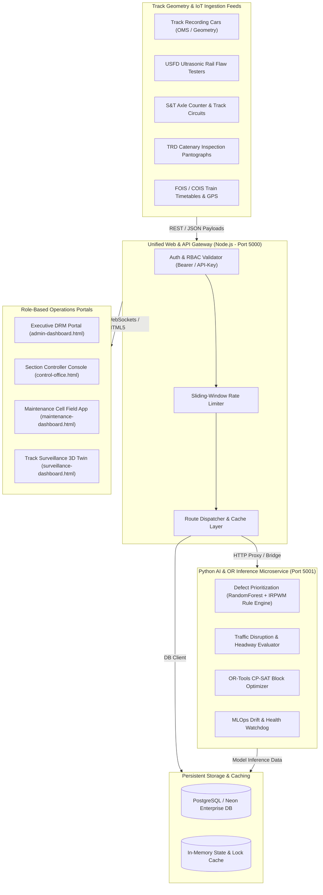
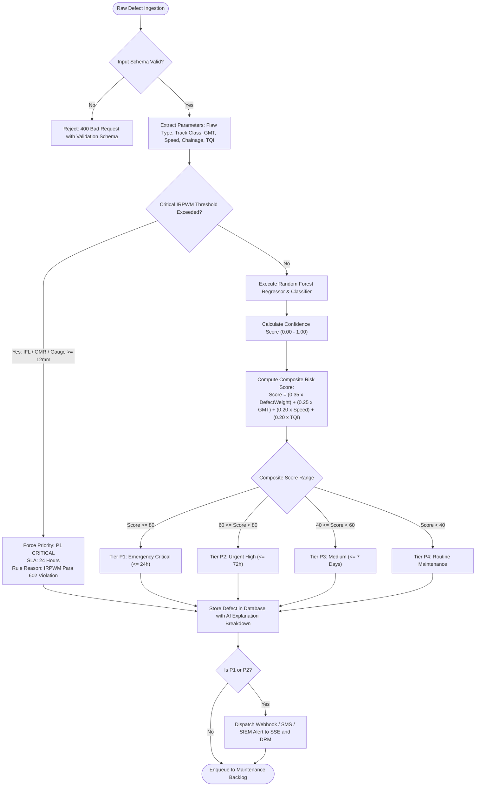
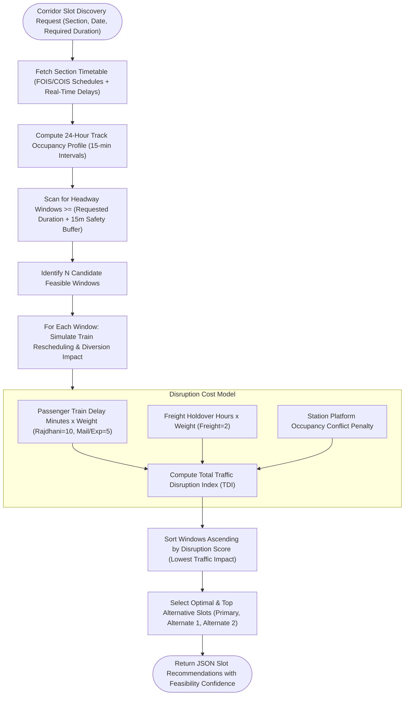
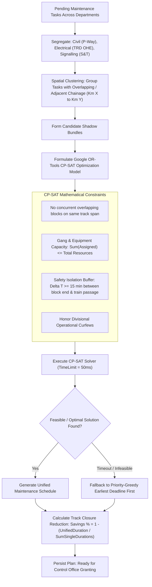
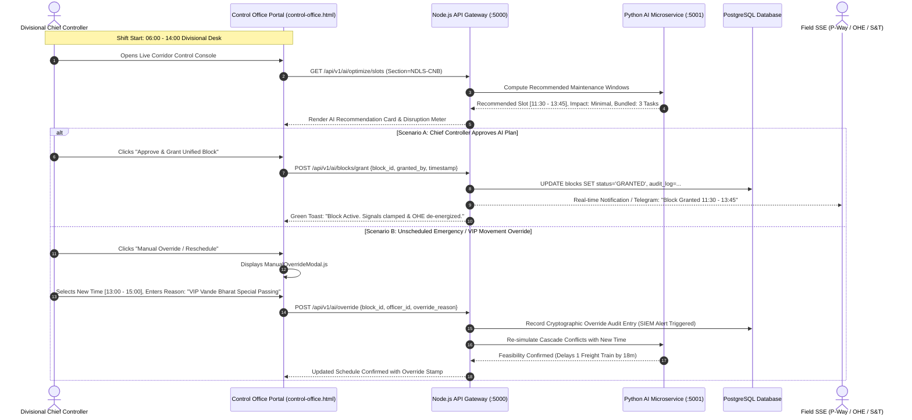

# 🧠 BRAIN.md — Indian Railways AI Platform (RAKSHA PATH)
### Master Architecture, Algorithmic Blueprints, Flowcharts & Implementation Manual
*System Version: 2.4.0-PROD | Compliance Standard: IRPWM 2020 Para 602 | Solver: Google OR-Tools CP-SAT*

---

## 📑 Table of Contents
1. [Executive Overview & Operational Context](#1-executive-overview--operational-context)
2. [End-to-End Visual Flowcharts (Mermaid)](#2-end-to-end-visual-flowcharts-mermaid)
   - [2.1 High-Level Data Ingestion & Microservice Flow](#21-high-level-data-ingestion--microservice-flow)
   - [2.2 AI Defect Triage & Prioritization Engine](#22-ai-defect-triage--prioritization-engine)
   - [2.3 Traffic Disruption & Candidate Slot Discovery](#23-traffic-disruption--candidate-slot-discovery)
   - [2.4 Cross-Department Bundling & CP-SAT Optimization Flow](#24-cross-department-bundling--cp-sat-optimization-flow)
   - [2.5 Control Office Human-in-the-Loop (HITL) Grant Workflow](#25-control-office-human-in-the-loop-hitl-grant-workflow)
3. [Complete Code Structure & Directory Map](#3-complete-code-structure--directory-map)
4. [Algorithmic & Mathematical Formulations](#4-algorithmic--mathematical-formulations)
   - [4.1 IRPWM 2020 Defect Scoring Model](#41-irpwm-2020-defect-scoring-model)
   - [4.2 Traffic Disruption Index (TDI) Metric](#42-traffic-disruption-index-tdi-metric)
   - [4.3 Google OR-Tools CP-SAT Combinatorial Block Scheduler](#43-google-or-tools-cp-sat-combinatorial-block-scheduler)
   - [4.4 Cross-Asset Shadow Block Bundling Logic](#44-cross-asset-shadow-block-bundling-logic)
5. [Runtime Network, Ports & API Gateway Specifications](#5-runtime-network-ports--api-gateway-specifications)
   - [5.1 Active Daemon Ports](#51-active-daemon-ports)
   - [5.2 Complete REST API Endpoints Registry](#52-complete-rest-api-endpoints-registry)
6. [Role-Based Access Control (RBAC) Matrix](#6-role-based-access-control-rbac-matrix)
7. [Implementation Roadmap & Verification Runbook](#7-implementation-roadmap--verification-runbook)

---

## 1. Executive Overview & Operational Context

The **Indian Railways AI Platform (RAKSHA PATH)** is an enterprise decision-support and automatic block scheduling engine engineered for the 68,000+ route-km Indian Railways network. The network accommodates $> 13,000$ passenger and $> 9,000$ freight trains daily. 

Historically, securing track maintenance blocks (track possessions) required tedious manual telephone coordination between **Divisional Control Offices** (Chief Controllers) and field engineering cells (P-Way, TRD/Electrical, S&T/Signalling). This led to:
- Frequent block denials causing critical track flaw deterioration.
- Uncoordinated single-department possessions causing repeated corridor closures.
- Cascade train delays across consecutive railway divisions.

### Core Strategic Targets
* **Safety First (Zero Missed Criticals)**: Automated classification conforming strictly to **IRPWM 2020 Para 602** (P1 Critical within 24h, P2 High within 72h, P3 Medium within 7d, P4 Routine).
* **Cross-Asset Shadow Bundling**: Co-scheduling Civil (P-Way), Electrical (TRD OHE catenary), and Signalling (S&T point machines & axle counters) inside unified corridors to reduce total aggregate track blockage by **$\ge 25\%$**.
* **Traffic De-Confliction**: Dynamic timetable collision simulation prioritizing high-priority passenger streams (Rajdhani, Shatabdi, Vande Bharat) over routine freight paths.
* **Sub-Second Mathematical Solver**: Google OR-Tools Constraint Programming (CP-SAT) resolving hundreds of multi-variable resource constraints in $< 0.05\text{s}$.
* **Human-In-The-Loop (HITL) Governance**: Strict divisional controller override authority with cryptographic audit logging and SIEM tracking.

---

## 2. End-to-End Visual Flowcharts (Mermaid)

### 2.1 High-Level Data Ingestion & Microservice Flow



---

### 2.2 AI Defect Triage & Prioritization Engine



---

### 2.3 Traffic Disruption & Candidate Slot Discovery



---

### 2.4 Cross-Department Bundling & CP-SAT Optimization Flow



---

### 2.5 Control Office Human-in-the-Loop (HITL) Grant Workflow



---

## 3. Complete Code Structure & Directory Map

Below is the complete architectural layout of the entire codebase, covering every subsystem, script, configuration, and interface:

```
indian-railways-ai/
├── BRAIN.md                                # Master Architectural & Algorithmic Blueprint (This Document)
├── server.js                               # Unified Node.js Web Server & Gateway Dispatcher (Port 5000)
├── index.html                              # High-impact Public Landing Page & Portal Launcher
├── package.json                            # Node.js Project Manifest & Scripts
├── CONFIGURATION.md                        # Environment Variables, Secrets & Database Config
├── INSTALL.md                              # Multi-Platform Installation Guide (Windows/Linux/Mac)
├── DEPLOYMENT.md                           # Docker, Kubernetes & Production Runbooks
├── TROUBLESHOOTING.md                      # Operational Failure Recovery & Diagnostic Matrix
│
├── ai-models/                              # Python AI, ML & Operations Research Microservices (Port 5001)
│   ├── requirements.txt                    # Python dependencies (ortools, fastapi, uvicorn, scikit-learn)
│   ├── README.md                           # AI Subsystem Architecture & Algorithm Docs
│   ├── monitoring.py                       # Real-Time Telemetry & MLOps Drift Monitor
│   │
│   ├── inference/                          # FastAPI REST Application Layer
│   │   ├── app.py                          # Application Entrypoint & Middleware Setup
│   │   ├── config.py                       # Host/Port, CORS, and Endpoint Definitions
│   │   ├── ingestion_api.py                # TMS, SMMS, TDMS Ingestion & Background Task Runner
│   │   ├── priority_api.py                 # REST Endpoints for Defect Scoring & Retraining
│   │   ├── traffic_api.py                  # REST Endpoints for Occupancy & Slot Discovery
│   │   ├── optimizer_api.py                # REST Endpoints for CP-SAT Block Scheduling
│   │   └── health_api.py                   # REST Endpoints for Diagnostics & Model Health
│   │
│   ├── priority-engine/                    # IRPWM 2020 Defect Prioritization Microservice
│   │   ├── config.json                     # Feature Weights, Risk Thresholds & SLA Rules
│   │   ├── defect_prioritizer.py           # Random Forest + IRPWM Rule Engine Implementations
│   │   ├── model_loader.py                 # Thread-Safe Joblib / ONNX Model Cache
│   │   └── artifacts/                      # Serialized Model Binaries (.joblib)
│   │
│   ├── traffic-predictor/                  # Corridor Traffic & Disruption Analyzer
│   │   ├── config.json                     # Train Weights, Station Headways & Curfews
│   │   ├── traffic_density_predictor.py    # Timetable Simulator & Delay Cost Estimator
│   │   └── slot_finder.py                  # Optimal Candidate Maintenance Window Finder
│   │
│   ├── block-optimizer/                    # Multi-Department CP-SAT Solver
│   │   ├── config.json                     # Solver Timeouts, Bundling Radii & Gang Limits
│   │   ├── block_scheduler.py              # Google OR-Tools CP-SAT Combinatorial Formulation
│   │   ├── spatial_clustering.py           # DBSCAN 2km Multi-Department Mega-Block Engine
│   │   └── task_bundler.py                 # Cross-Asset Spatio-Temporal Bundling Engine
│   │
│   ├── shared/                             # Shared AI Utilities & Connectors
│   │   ├── database_connector.py           # Threaded PostgreSQL Pool with Fallback
│   │   ├── logger.py                       # Structured Loguru / JSON Stream Logger
│   │   ├── models.py                       # Pydantic Schemas (Defect, Slot, Block, Task)
│   │   └── utils.py                        # Geo-Calculations, Chainage Interpolation & Formatting
│   │
│   └── training/                           # Offline Model Training & Evaluation Pipelines
│       ├── train_priority_model.py         # Synthetic/Empirical Dataset Training Script
│       └── prepare_training_data.py        # Feature Engineering & Normalization Script
│
├── backend/                                # Node.js Core Backend & API Gateway Subsystem
│   ├── api/                                # HTTP Controllers & Middlewares
│   │   └── ai-api.js                       # Express / Standalone Dispatcher for all /api/v1/ai routes
│   │
│   ├── services/                           # Pure Node.js Fallbacks & Enterprise Services
│   │   ├── ai-service-connector.js         # HTTP Client to Python Backend with Circuit Breaker
│   │   ├── defect-validator.js             # Strict JSON Schema & Range Validation Engine
│   │   ├── priority-engine.js              # Native JavaScript IRPWM Priority Fallback
│   │   ├── traffic-analyzer.js             # Native JavaScript Headway & Slot Finder Fallback
│   │   ├── block-optimizer.js              # Native JavaScript Greedy Bundler Fallback
│   │   ├── alert-service.js                # Webhook, Telegram & SIEM Alerting Dispatcher
│   │   ├── health-monitor.js               # Cross-Service Health & Heartbeat Checker
│   │   ├── log-aggregator.js               # Structured Request/Response Log Storage
│   │   ├── metrics-dashboard.js            # Prometheus / Operational Metric Exporter
│   │   └── performance-monitor.js          # Latency, Memory & Event-Loop Lag Tracker
│   │
│   ├── config/                             # Gateway Configurations
│   │   └── ai-config.js                    # Endpoint URLs, Timeouts & Circuit Breaker Thresholds
│   │
│   └── models/                             # JavaScript Data Validation Models
│       └── validation-schemas.js           # Input Sanitation for API Gateway
│
├── frontend/                               # Enterprise Web Client Portals & Visualizations
│   ├── main-app.js                         # Global Portal Controller, Routing & State Sync
│   │
│   ├── pages/                              # Department & Role Dedicated Dashboards
│   │   ├── login.html                      # Unified Security & Single Sign-On Portal
│   │   ├── control-office.html             # Section Chief Controller Live Traffic Console
│   │   ├── admin-dashboard.html            # Executive DRM Network Overview & KPI Dashboard
│   │   ├── maintenance-dashboard.html      # Field SSE P-Way Work-Order & Gang Manager
│   │   ├── surveillance-dashboard.html     # Track Geometry & USFD Ultrasonic 3D Digital Twin
│   │   ├── ai-model-management.html        # MLOps Model Performance, Drift & Retrain Center
│   │   ├── data-sources.html               # TRC, USFD, OMS, OHE Ingestion Source Monitor
│   │   └── project-summary.html            # High-Level Architecture & Stakeholder Briefing
│   │
│   ├── components/                         # Reusable UI Custom Elements & Widgets
│   │   ├── SharedNav.js                    # Consistent Header, Role Badge & Notification Nav
│   │   ├── PriorityScoreBadge.js           # P1/P2/P3/P4 Color-Coded Pulsing Status Badge
│   │   ├── AIExplanationCard.js            # Explainable AI (XAI) Feature Importance Breakdown
│   │   ├── BundlingSuggestionCard.js       # Shadow Block Visual Savings & Task Combiner
│   │   ├── TrafficImpactMeter.js           # Dynamic Visual Gauge of Corridor Disruption
│   │   ├── SlotFeasibilityIndicator.js     # Confidence Meter for Window Feasibility
│   │   ├── ManualOverrideModal.js          # HITL Cryptographic Override & Reason Capture
│   │   ├── ConfidenceIndicator.js          # Statistical Confidence Bars
│   │   ├── dashboard-charts.js             # Chart.js Real-Time Trend Visualizers
│   │   ├── map-canvas.js                   # Interactive Track Map & Section Route View
│   │   ├── three-scene.js                  # Three.js 3D Interactive Digital Twin Rail Canvas
│   │   ├── user-store.js                   # Session State, Token Storage & RBAC Helper
│   │   ├── auth-guard.js                   # Client-Side Route Protection & Redirection
│   │   └── animations.js                   # Smooth Micro-Animations & Transition Hooks
│   │
│   ├── styles/                             # Cascading Style Sheets
│   │   ├── main.css                        # Official Indian Railways Navy/Gold Design System
│   │   └── components.css                  # Card, Modal, Table & Layout Utilities
│   │
│   └── assets/                             # Logos, Emblems, Icons & Mock Geometries
│
├── database/                               # PostgreSQL / Neon Database Schemas & Migrations
│   ├── schema/
│   │   ├── postgis_railway.sql             # PostGIS Linear Referencing & Multi-Dept Defect Schema
│   │   ├── blocks.sql                      # Maintenance Blocks, Tasks & Bundling Tables
│   │   └── trains.sql                      # Timetables, Section Routes & Stations Tables
│   ├── migrations/                         # Versioned SQL Migration Scripts
│   ├── seeds/                              # Synthetic Test Data (Delhi-Kanpur Corridor)
│   └── backups/                            # Backup & Restore Verification Scripts
│
├── deployment/                             # Containerization & Infrastructure Configs
│   ├── docker/
│   │   ├── Dockerfile.frontend             # Nginx Static Web Container
│   │   ├── Dockerfile.backend              # Node.js API Gateway Container
│   │   ├── Dockerfile.ai                   # Python FastAPI & OR-Tools Container
│   │   └── docker-compose.yml              # Complete Multi-Container Local Stack
│   └── scripts/                            # Staging, Health-Check & Backup Shell Scripts
│
└── testing/                                # Verification & Quality Acceptance Suite
    ├── run-all-tests.js                    # Master Test Runner (Unit, Security, E2E, Load)
    ├── unit-tests/                         # Individual Component & Math Verification
    ├── integration-tests/                  # Microservice Bridge & Gateway Route Tests
    ├── security-tests/                     # SQL Injection, XSS, RBAC & Rate Limit Tests
    ├── performance-tests/                  # OR-Tools Solver Stress & Gateway Latency Tests
    ├── uat-scenarios/                      # User Acceptance Scenarios (Emergency, Bundles)
    └── test-data/                          # Synthetic Defects, Timetables & Gang Rosters
```

---

## 4. Algorithmic & Mathematical Formulations

### 4.1 IRPWM 2020 Defect Scoring Model
Track defect prioritization calculates an urgency score $S \in [0, 100]$ based on the Indian Railways Permanent Way Manual (IRPWM 2020, Para 602):

$$S = w_d \cdot D_{\text{norm}} + w_g \cdot G_{\text{norm}} + w_v \cdot V_{\text{norm}} + w_t \cdot T_{\text{norm}}$$

Where:
- $w_d = 0.35$ (Intrinsic defect severity weight: Flaw depth, crack length, gauge deviation)
- $w_g = 0.25$ (Traffic density weight in Gross Million Tonnes per annum, GMT)
- $w_v = 0.20$ (Maximum permissible section line speed in km/h, up to 160 km/h for Vande Bharat)
- $w_t = 0.20$ (Track Quality Index, TQI: Standard deviation of unevenness, twist, and alignment)

#### Severity Triage Matrix
| Tier | Score Range | Priority Level | Maximum Resolution SLA | Hard Override Triggers |
| :--- | :--- | :--- | :--- | :--- |
| **P1** | $80 \le S \le 100$ | **Emergency Critical** | $\le 24$ Hours | IFL Ultrasonic flaw, Gauge spread $\ge 12\text{mm}$, OMR flaw |
| **P2** | $60 \le S < 80$ | **Urgent High** | $\le 72$ Hours | Transverse rail crack, Weld defect, Severe cant deficiency |
| **P3** | $40 \le S < 60$ | **Medium** | $\le 7$ Days | Minor ballast deficiency, Sleepers wear, Catenary droop |
| **P4** | $0 \le S < 40$ | **Routine** | Planned Cycle | Cosmetic rail grinding, Vegetation clearing |

---

### 4.2 Traffic Disruption Index (TDI) Metric
To evaluate a proposed block window $[t_{\text{start}}, t_{\text{end}}]$ on a given section:

$$\text{TDI} = \sum_{i \in \text{Trains}} W_i \cdot \Delta t_i + P_{\text{plat}} + P_{\text{freight}}$$

Where:
- $W_i$: Priority weight of train $i$ ($W_{\text{Rajdhani/Vande Bharat}} = 10$, $W_{\text{Mail/Express}} = 5$, $W_{\text{Passenger}} = 3$, $W_{\text{Freight}} = 1.5$).
- $\Delta t_i$: Estimated delay incurred by train $i$ (minutes).
- $P_{\text{plat}}$: Penalty for conflicting with passenger platform dwell schedules at junction stations.
- $P_{\text{freight}}$: Yard detention penalty for held freight rakes.

---

### 4.3 Google OR-Tools CP-SAT Combinatorial Block Scheduler

Let:
- $\mathcal{T} = \{1, \dots, N\}$ be the set of pending maintenance tasks.
- For each task $i \in \mathcal{T}$, let $d_i$ be its required uninterrupted duration, and $[e_i, l_i]$ be its allowable execution time window.
- Let $M$ be a large positive constant.

#### Decision Variables:
- $s_i \in [e_i, l_i]$: Start time of task $i$.
- $e_i = s_i + d_i$: End time of task $i$.
- $I_i$: Interval variable representing $[s_i, e_i]$.
- $b_{ij} \in \{0, 1\}$: Binary variable equal to 1 if task $i$ and task $j$ are bundled into the same block possession.

#### Objective Function:
$$\min \left( \sum_{i \in \mathcal{T}} \text{TDI}(s_i, e_i) + \sum_{i \in \mathcal{T}} C_{\text{urgency}}(l_i - e_i) - \lambda \sum_{i < j} b_{ij} \cdot \text{SavedMinutes}_{ij} \right)$$

#### Hard Operational Constraints:
1. **Track Exclusivity (Non-Overlapping Single Line Tasks)**:
   For any two independent tasks $i, j$ requiring track possession on the same section without bundling:
   $$s_j \ge s_i + d_i + \text{Buffer} \quad \lor \quad s_i \ge s_j + d_j + \text{Buffer}$$
   *(Modeled via `model.AddNoOverlap([I_i, I_j])`)*.

2. **Resource & Gang Capacity Limits**:
   $$\sum_{i \in \mathcal{T} \text{ active at } t} \text{GangCrew}_i \le \text{TotalAvailableCrew}(t) \quad \forall t$$
   *(Modeled via `model.AddCumulative()`)*.

3. **Mandatory Block Isolation Distance**:
   $$\text{Distance}(Task_i, Task_j) \ge D_{\text{safety}} \quad \text{if both active simultaneously on adjacent tracks}.$$

---

### 4.4 Cross-Asset Shadow Block Bundling Logic
When Civil (Track), Electrical (OHE), and S&T (Signalling) share a track segment:

```
Uncoordinated Disjoint Execution (Total Closure = 270 min):
Civil:       [====== 120 min ======]
Electrical:                          [=== 90 min ===]
S&T:                                                   [== 60 min ==]

AI-Bundled Unified Shadow Block (Total Closure = 140 min | 48.1% Savings!):
Corridor:    [================ 140 min ================]
Civil:       [====== 120 min ======]
Electrical:        [=== 90 min ===]
S&T:                     [== 60 min ==]
```

**Bundling Feasibility Rules:**
1. Same or contiguous railway block section ($\le 5\text{ km}$ spacing).
2. Electrical power cut (OHE de-energization) requested by Civil coincides with TRD inspection window.
3. Total unified duration = $\max(d_{\text{Civil}}, d_{\text{TRD}}, d_{\text{S\&T}}) + \text{SafetyMargin (15m)}$.

---

## 5. Runtime Network, Ports & API Gateway Specifications

### 5.1 Active Daemon Ports

| Daemon / Service | Process Engine | Port | URL | Health Check Endpoint |
| :--- | :--- | :--- | :--- | :--- |
| **Unified Web & Gateway** | Node.js (v24+) | **5000** | `http://localhost:5000` | `GET http://localhost:5000/frontend/pages/login.html` |
| **AI Inference Microservice**| Python FastAPI | **5001** | `http://127.0.0.1:5001` | `GET http://127.0.0.1:5001/api/v1/health` |
| **Interactive API Docs** | FastAPI Swagger | **5001** | `http://127.0.0.1:5001/docs` | `GET http://127.0.0.1:5001/docs` |

---

### 5.2 Complete REST API Endpoints Registry

All routes support Bearer Token / API Key authentication (`Authorization: Bearer <token>` or `X-API-Key: ir-ai-key-2026`).

#### Subsystem 1: Defect Prioritization (`/api/v1/ai/prioritize` or `/api/v1/prioritize`)
* `POST /defect`: Compute priority score and IRPWM category for a single defect record.
* `POST /batch`: Bulk triage of hundreds of track recording defects.
* `GET  /model-info`: Inspect active Random Forest hyperparameters, accuracy, and training date.
* `POST /retrain`: Trigger asynchronous retraining against newly verified maintenance logs.

#### Subsystem 2: Traffic & Corridor Analysis (`/api/v1/ai/traffic` or `/api/v1/traffic`)
* `POST /occupancy`: Generate 24-hour section occupancy timeline.
* `POST /slots`: Find all candidate maintenance windows matching requested duration.
* `POST /best-slots`: Return top-3 ranked windows with minimal Traffic Disruption Index (TDI).
* `POST /forecast`: Predict expected corridor delays for arbitrary time intervals.

#### Subsystem 3: Block Optimization (`/api/v1/ai/optimize` or `/api/v1/optimize`)
* `POST /schedule`: Solve multi-task scheduling via Google OR-Tools CP-SAT.
* `POST /bundle`: Group pending multi-department tasks into unified shadow blocks.
* `GET  /constraints`: Inspect current section headway, curfew, and gang availability limits.
* `POST /validate`: Verify if a proposed manual block schedule violates safety constraints.

#### Subsystem 4: Health & Diagnostics (`/api/v1/ai/health` or `/api/v1/health`)
* `GET  /`: System health, uptime, and connected subsystem availability.
* `GET  /models`: Memory and latency status of active ML models.
* `GET  /database`: Database connection pool status and ping latency.

#### Subsystem 5: Multi-System Ingestion & Spatial Mega-Blocks (`/api/v1`)
* `POST /defects/ingest`: Ingest single defect from TMS, SMMS, TDMS with real-time priority scoring.
* `POST /defects/ingest-batch`: Enterprise bulk ingestion with deduplication.
* `GET  /defects`: List pending defects filtered by section, department, or priority category.
* `POST /optimize/generate-plan`: Asynchronous background task solver generating multi-day block plans.
* `GET  /optimize/plan/{job_id}`: Poll status and inspect results of background optimization jobs.
* `POST /optimize/cluster-spatial`: DBSCAN $\le 2\text{ km}$ spatial clustering engine grouping Civil, S&T, and TRD tasks into unified Mega-Blocks.

#### Subsystem 6: Live Train Movement & Location Tracking (RapidAPI / IRCTC) (`/api/v1`)
* `GET  /live-trains-at-station/{station_code}`: Real-time arrivals & departures within X hours via RapidAPI IRCTC feed.
* `GET  /live-running-status/{train_number}`: Current GPS train location, speed, and sectional delay minutes.
* `POST /live-corridor-conflicts`: Cross-reference proposed block window against live passenger/freight train movements.
* `GET  /gateway-config`: Inspect active RapidAPI credentials, masked keys, and CRIS/COA failover status.

---

## 6. Role-Based Access Control (RBAC) Matrix

| Portal / Feature | Divisional Railway Manager (DRM) | Chief Controller (Control Office) | Senior Section Engineer (SSE P-Way) | S&T / TRD Inspector | Auditor / Read-Only |
| :--- | :---: | :---: | :---: | :---: | :---: |
| **Executive Overview (`admin-dashboard.html`)** | Full Control | View | View | View | View Only |
| **Grant / Reject Blocks (`control-office.html`)**| View / Override | **Primary Authority** | Request Only | Request Only | No Access |
| **Emergency Manual Override** | Supervise | **Execute & Log** | No Access | No Access | No Access |
| **Field Work Orders (`maintenance-dashboard.html`)**| View | Assign | **Execute & Sign-Off**| **Execute (Self Dept)**| View Only |
| **3D Track Twin (`surveillance-dashboard.html`)**| View | View | Real-Time Inspection | Real-Time Inspection| View |
| **AI Retrain / MLOps (`ai-model-management.html`)**| View | No Access | View Explanations | View Explanations | No Access |

---

## 7. Implementation Roadmap & Verification Runbook

### 7.1 Master Verification Command
To verify the entire platform, run the comprehensive automated acceptance suite:

```powershell
# Run the automated end-to-end verification suite
node testing/run-all-tests.js
```

### 7.2 Service Startup Runbook

```powershell
# Step 1: Launch the Python AI & OR-Tools Microservice (Port 5001)
python ai-models/inference/app.py

# Step 2: In a separate terminal, launch the Unified Web & Gateway Server (Port 5000)
node server.js

# Step 3: Access the platform in browser
Start-Process "http://localhost:5000/frontend/pages/control-office.html"
```

### 7.3 Operational Checklist for Divisional Go-Live
1. **Network Connectivity**: Ensure low-latency fiber links between Divisional Control Office and FOIS servers.
2. **Model Calibration**: Verify local division track constants (GMT values, line speed, curve radii) in `ai-models/priority-engine/config.json`.
3. **Audit Compliance**: Confirm that manual override audit logs in PostgreSQL have write-once/immutable append logging enabled.
4. **Fallback Resilience**: Verify that if the Python microservice is interrupted, the Node.js API Gateway seamlessly activates its native fallback algorithms without user interruption.

---
*Document Maintained by the Indian Railways Advanced AI Directorate.*
