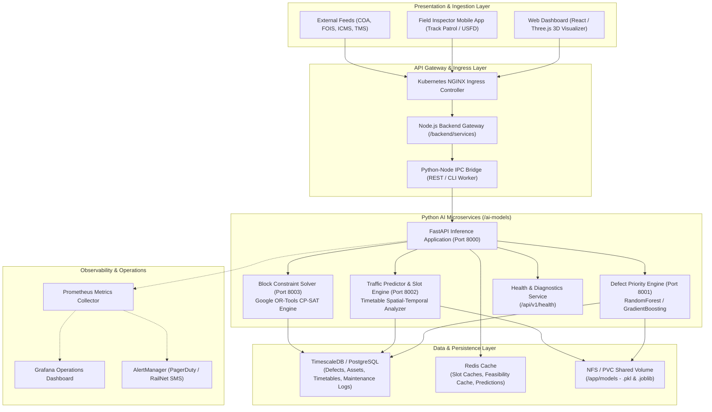
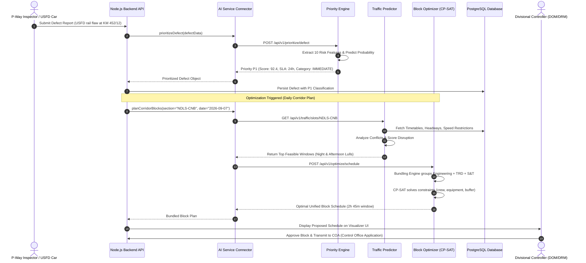

# Indian Railways Maintenance AI Platform: System Architecture

## 1. Executive Overview

The **Indian Railways AI Maintenance Block Planning Platform** is an enterprise-grade decision-support and optimization system designed to transform track maintenance coordination across the Indian Railways network (spanning 68,000+ route kilometers and 17 railway zones). 

Historically, corridor maintenance blocks—periods where train movements are halted or regulated to allow engineering work—are planned manually by Section Controllers, Divisional Operations Managers (DOM), and Senior Divisional Engineers (Sr. DEN). This results in severe traffic disruptions, missed maintenance windows, and uncoordinated work across departments (Civil/Engineering, Electrical/TRD, Signalling & Telecommunication/S&T, and Mechanical/Rolling Stock).

This AI platform unifies:
1. **Defect Prioritization & Urgency Classification**: Multi-factor machine learning risk ranking.
2. **Train Traffic Forecasting & Corridor Slot Discovery**: Dynamic timetable collision detection and disruption scoring.
3. **Multi-Department Constraint Optimization**: Combinatorial constraint satisfaction engine powered by Google OR-Tools CP-SAT.

---

## 2. Component Architecture Diagram

---

## 3. End-to-End Data Flow

The following sequence illustrates how an inspection defect translates into an approved, multi-department corridor block:

---

## 4. Integration Points

### 4.1 Node.js Backend to Python AI Bridge
Communication between the Node.js enterprise backend and the Python machine learning microservice operates in dual-mode:
1. **High-Performance REST Daemon (Primary)**:
   - Node.js `ai-service-connector.js` sends asynchronous HTTP requests with keep-alive connections to `http://localhost:5000` (or `8000` in containerized environments).
   - In-memory circuit breaker pattern automatically detects timeouts and failures.
2. **Direct CLI Subprocess (Offline / Fallback)**:
   - If the HTTP daemon becomes unreachable, `python-runner.py` is invoked via `child_process.spawn`.
   - Executes Python inference scripts directly using system Python interpreter and returns JSON results via standard output.

### 4.2 Database Integration
- Direct connection via connection-pooled `psycopg2-binary` engine with offline simulation resilience.
- Tables accessed:
  - `defects`: Inspection observations, severity, asset tags, GPS coordinates.
  - `train_movements`: Real-time and historical train punctuality and block section occupancy.
  - `block_requests`: Work permits submitted by P-Way, TRD, and S&T supervisors.
  - `block_schedules`: Optimized and finalized maintenance schedules.

### 4.3 Railway Operations Integration
- **COA (Control Office Application)**: Ingests real-time section occupancy and outputs approved block authorizations.
- **FOIS (Freight Operations Information System)**: Feeds freight rake availability and coal/iron ore corridor demand forecasts.
- **ICMS (Integrated Coaching Management System)**: Feeds passenger train rakes, maintenance schedules, and speed profiles.

---

## 5. Deployment Architectures

### Option A: Bare-Metal / On-Premise Virtual Machines (Divisional HQs)
- Direct Python 3.11 virtual environment deployment managed by systemd services.
- Automated installation using `deployment/scripts/setup-ai-environment.sh`.
- Minimal hardware requirements: 4 vCPU, 8 GB RAM, 50 GB SSD storage.

### Option B: Docker Compose (Testing & Zonal Deployment)
- Orchestrated with `deployment/docker-compose-ai.yml`.
- Segregated microservices for Priority, Traffic, and Optimizer.
- Shared model storage volume (`ai_models_data`) ensuring model updates propagate to all containers without image rebuilds.

### Option C: Enterprise Kubernetes / OpenShift (CRIS Cloud)
- Fully containerized production deployment using `deployment/kubernetes/ai-deployment.yaml` and `deployment/kubernetes/ai-service.yaml`.
- Includes Horizontal Pod Autoscaling (HPA), ConfigMaps, Kubernetes Secrets, and zero-downtime rolling updates.

---

## 6. Scaling & High-Availability Strategy

| Component | Scaling Strategy | Failure Mode / Resilience |
|---|---|---|
| **Priority Engine** | Horizontal pod scaling (2 to 8 replicas) based on CPU > 70% | Stateless inference; immediate failover across replicas. Local rule-based fallback if model file is missing. |
| **Traffic Predictor** | Horizontal pod scaling (2 to 6 replicas) | Caches section timetables in Redis with 1-hour TTL to prevent DB query storms. |
| **Block Optimizer** | Multi-worker parallel search (4 CP-SAT workers per pod) | Hard solver timeout (default 30s) prevents thread starvation; returns best feasible incumbent solution if optimal proof exceeds deadline. |
| **Database** | Read replicas for timetable & defect queries | Offline mock database generator allows full functionality even during network isolation. |
| **Model Weights** | NFS / ReadWriteMany Kubernetes PVC | Automatic reload trigger (`POST /api/v1/priority/retrain`) with hot swap in RAM. |
