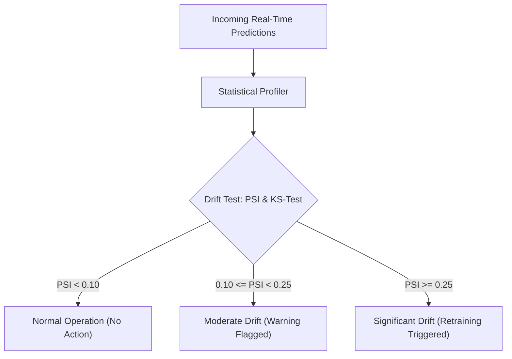

# AI Monitoring, Observability & Drift Detection Guide

## 1. Overview

Deploying machine learning models in railway safety-critical operations demands continuous telemetry, real-time alerting, and automated drift detection. This guide describes the monitoring framework deployed across the Indian Railways AI platform.

---

## 2. Telemetry & Metrics to Track

The platform emits Prometheus metrics across four categories:

### 2.1 Inference Performance & Latency
- `ai_prediction_duration_seconds_bucket`: Histogram of prediction latency broken down by service (`priority-engine`, `traffic-predictor`, `block-optimizer`).
- `ai_solver_duration_seconds`: Time spent in OR-Tools CP-SAT constraint resolution.

### 2.2 Model Accuracy & Drift
- `ai_model_accuracy_ratio`: Rolling ratio of predicted priority category vs confirmed field resolution tier.
- `ai_defect_prioritized_total`: Counter partitioned by priority category (`P1`, `P2`, `P3`, `P4`).
- `ai_feature_value_distribution`: Gauges tracking running mean and variance of critical input features (e.g. `traffic_density_gmt`).

### 2.3 API Health & Throughput
- `http_requests_total`: Request counts labeled by endpoint, HTTP status code (`200`, `400`, `500`), and client application.
- `http_request_duration_seconds`: Endpoint response latency.

### 2.4 Resource Saturation
- Pod CPU, memory RSS, network I/O, and PostgreSQL connection pool utilization.

---

## 3. Alerting Thresholds & Notification Escalation

The Prometheus alerting rules defined in [deployment/monitoring/ai-metrics.yaml](file:///c:/Users/ry729/.gemini/antigravity-ide/scratch/indian-railways-ai/deployment/monitoring/ai-metrics.yaml) enforce the following SLA guarantees:

| Alert Name | Condition | Severity | Escalation Path |
|---|---|---|---|
| **HighPredictionLatency** | p95 Latency > 500ms for 3 mins | Warning | DevOps On-Call (Slack / Email) |
| **ModelAccuracyDegraded** | Classification accuracy < 85% for 10 mins | Critical | Lead Data Scientist / AI Ops |
| **P1FalseNegativeAnomaly** | Any P1 defect initially scored as P3/P4 | Blocker / P0 | Safety Commissioner & Sr. DEN |
| **HighApiErrorRate** | 5xx errors > 2% of total traffic | Critical | DevOps / Site Reliability Engineer |
| **HighCpuUtilization** | Container CPU > 85% for 5 mins | Warning | Autoscaling HPA triggers; DevOps notified |
| **SolverTimeoutSpike** | CP-SAT solver exceeds 30s deadline > 5% | Warning | Operations Research Engineer |

---

## 4. Logging Strategy

All AI components utilize structured JSON logging via `shared/logger.py` for automated indexing into Elasticsearch / Fluentd / Kibana (EFK stack):

```json
{
  "timestamp": "2026-09-06T03:10:00.124Z",
  "level": "INFO",
  "logger": "priority_engine",
  "trace_id": "req-9a4f-8812c",
  "defect_id": "DEF-CIVIL-2026-001",
  "priority_score": 92.4,
  "category": "P1",
  "latency_ms": 14.8,
  "action": "DEFECT_PRIORITIZATION_COMPLETE"
}
```

- **Retention**: Hot tier (Elasticsearch) for 30 days; cold archive (S3 / Ceph) for 7 years to comply with statutory railway safety audit regulations.
- **Log Rotation**: Size-based rotation at 100 MB per file, maintaining 10 backup archives.

---

## 5. Model Drift Detection

Track conditions, monsoon rainfall, freight loading variations, and line electrification cause operational distributions to shift over time (**covariate shift** and **concept drift**).



### Methods Implemented:
1. **Population Stability Index (PSI)**:
   $$PSI = \sum \left( \text{Actual}\% - \text{Expected}\% \right) \times \ln\left(\frac{\text{Actual}\%}{\text{Expected}\%}\right)$$
   Evaluated weekly across feature distributions. A value $\ge 0.25$ indicates significant drift.
2. **Two-Sample Kolmogorov-Smirnov (KS) Test**:
   Compares the distribution of predicted priority scores over the trailing 14 days against the validation dataset baseline ($p < 0.05$ flags distribution divergence).

---

## 6. Automated Retraining Triggers

Model retraining is initiated when any of the following triggers occur:
1. **Scheduled Cadence**: Automatic 1st of every month retraining with trailing 12-month defect data.
2. **Data Drift Trigger**: Feature PSI exceeds `0.25` for two consecutive weekly runs.
3. **Accuracy Floor Trigger**: Verified field defect resolution accuracy drops below `85%`.
4. **Permanent Way Manual Policy Change**: Revision of departmental risk weightings or introduction of new inspection machinery (e.g. drone LIDAR feeds).
