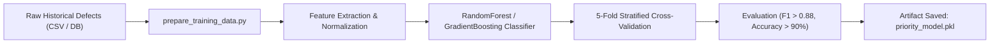

# Defect Priority Engine: Technical Guide

## 1. Overview

The **Defect Priority Engine** (`ai-models/priority-engine/`) evaluates track anomalies, infrastructural flaws, and equipment degradation reported across Indian Railways. It computes a continuous risk score (0–100) and categorizes defects into strict maintenance priority classes (`P1`, `P2`, `P3`, `P4`) with legal Indian Railway Service Level Agreements (SLAs).

---

## 2. Feature Engineering & Descriptions

The model evaluates **10 core engineered features** extracted from track defect records, asset registry, and operational databases:

| Feature Name | Type | Range / Values | Weight | Description |
|---|---|---|---|---|
| `safety_severity` | Categorical / Ordinal | CRITICAL (100), HIGH (75), MEDIUM (45), LOW (20) | 0.22 | Severity graded according to the Indian Railways Permanent Way Manual (IRPWM). |
| `traffic_density` | Continuous | 0 – 150 GMT (Gross Million Tonnes per annum) | 0.14 | Annual traffic volume traveling over the affected track section. |
| `overdue_days` | Integer | 0 – 365 days | 0.12 | Days elapsed beyond mandatory maintenance inspection or rectification target date. |
| `failure_probability` | Continuous | 0.0 – 1.0 | 0.12 | Probability of catastrophic rail break, weld fracture, or derailment if left unrectified. |
| `asset_criticality` | Categorical / Ordinal | 1 (Low) to 5 (Crucial diamond crossing / bridge approach) | 0.10 | Strategic and structural importance of the track asset. |
| `redundancy_factor` | Continuous | 0.0 – 1.0 | 0.08 | Availability of parallel track lines, loop sidings, or bypass routes (1.0 = single line bottleneck). |
| `defect_age` | Integer | 0 – 180 days | 0.06 | Age of the recorded defect since initial detection. |
| `inspection_source_weight` | Categorical | USFD (100), TRC (92), OMS (85), ITMS (88), PATROL (80), DRONE (70), MANUAL (65) | 0.06 | Reliability weight of the source detection system (e.g. Ultrasonic Flaw Detection Car vs manual patrol). |
| `department_weight` | Categorical | CIVIL (95), TRD_OHE (90), SIGNALLING (88), ROLLING_STOCK (80) | 0.05 | Departmental risk weighting based on safety consequence severity. |
| `location_criticality` | Categorical / Ordinal | 1 – 4 | 0.05 | Track proximity to bridges, tunnels, station yards, or steep gradients (Ghat sections). |

---

## 3. Scoring Methodology & Classification

The scoring pipeline operates through a hybrid machine learning and expert rule-based engine:

```
Total Priority Score = (ML Probability * 100) * 0.70 + (Rule-Based Weighted Score) * 0.30
```

### Priority Categories & SLA Tiers

| Priority Tier | Score Range | Classification Label | SLA Hours | Indian Railways Action Protocol |
|---|---|---|---|---|
| **P1** | 85.0 – 100.0 | Critical / Immediate Intervention | **24 Hours** | Immediate emergency block, speed restriction (PSR/TSR to 20 km/h) or traffic stop. Senior DEN informed. |
| **P2** | 70.0 – 84.9 | High Priority / Planned Window | **72 Hours** | Scheduled in immediate corridor maintenance block within 3 days. |
| **P3** | 50.0 – 69.9 | Medium Priority / Rolling Corridor | **168 Hours (7 Days)** | Batched with upcoming departmental rolling maintenance window. |
| **P4** | 0.0 – 49.9 | Low / Routine Inspection | **720 Hours (30 Days)** | Routine upkeep during standard track inspection cycles. |

---

## 4. Model Training Process

The model is implemented in `ai-models/priority-engine/defect_prioritizer.py` and trained via `ai-models/training/train_priority_model.py`.



### Hyperparameters:
- Algorithm: `RandomForestClassifier` (with `GradientBoostingClassifier` comparison)
- Number of Estimators: `120`
- Max Depth: `6`
- Min Samples Split: `4`
- Criterion: `gini` / `log_loss`

---

## 5. Configuration Options (`config.json`)

Located at [ai-models/priority-engine/config.json](file:///c:/Users/ry729/.gemini/antigravity-ide/scratch/indian-railways-ai/ai-models/priority-engine/config.json):

```json
{
  "service": "priority-engine",
  "model_type": "RandomForestClassifier",
  "n_estimators": 120,
  "max_depth": 6,
  "priority_thresholds": {
    "P1": { "min_score": 85, "max_score": 100, "sla_hours": 24 },
    "P2": { "min_score": 70, "max_score": 84, "sla_hours": 72 },
    "P3": { "min_score": 50, "max_score": 69, "sla_hours": 168 },
    "P4": { "min_score": 0, "max_score": 49, "sla_hours": 720 }
  },
  "feature_weights": {
    "safety_severity": 0.22,
    "traffic_density": 0.14,
    "overdue_days": 0.12,
    "failure_probability": 0.12
  }
}
```

---

## 6. Usage Examples

### 6.1 Calling via REST API
```bash
curl -X POST http://localhost:8000/api/v1/prioritize/defect \
  -H "Content-Type: application/json" \
  -d '{
    "defect_id": "DEF-2026-USFD-091",
    "defect_type": "RAIL_FRACTURE_IMMINENT",
    "department": "CIVIL",
    "safety_severity": "CRITICAL",
    "track_section": "NDLS-CNB-UP",
    "traffic_density_gmt": 95.5,
    "overdue_days": 4,
    "inspection_source": "USFD",
    "failure_probability": 0.88,
    "asset_criticality": 5
  }'
```

**Response:**
```json
{
  "defect_id": "DEF-2026-USFD-091",
  "priority_score": 93.4,
  "category": "P1",
  "label": "Critical / Immediate Intervention",
  "sla_hours": 24,
  "action_required": "Immediate block required within 24 hours",
  "explanation": "High risk driven by CRITICAL safety severity (0.22 weight) and USFD detection on 95.5 GMT track section."
}
```

### 6.2 Calling via Python Direct Import
```python
from priority_engine.defect_prioritizer import DefectPrioritizer

prioritizer = DefectPrioritizer()
result = prioritizer.prioritize_defect({
    "defect_id": "DEF-CIVIL-04",
    "safety_severity": "HIGH",
    "department": "CIVIL",
    "traffic_density_gmt": 80.0,
    "overdue_days": 2
})
print(f"Priority: {result.category}, Score: {result.score}")
```

---

## 7. Troubleshooting & FAQ

**Q: What happens if `priority_model.pkl` is missing or corrupted?**  
A: The engine features automated graceful degradation. If the serialised model fails to load, `DefectPrioritizer` immediately switches to deterministic weighted expert rule-based scoring without throwing 500 errors.

**Q: How do we trigger model retraining with new inspection data?**  
A: Send a POST request to `POST /api/v1/priority/retrain`. The service will retrain against the updated defect records and hot-swap the active model in memory with zero downtime.
