# Traffic Predictor & Slot Discovery Engine: Technical Guide

## 1. Overview

The **Traffic Predictor & Corridor Slot Discovery Engine** (`ai-models/traffic-predictor/`) models real-time and planned train density across Indian Railway block sections. It detects spatial-temporal collisions between scheduled train paths and proposed maintenance blocks, estimates traffic disruption penalties, and automatically discovers optimal maintenance windows that minimize passenger and freight delay.

---

## 2. Traffic Analysis Methodology

Indian Railways operates on fixed block signaling (Absolute Block or Automatic Block Signalling). Scheduling a maintenance block effectively closes a block section to all revenue traffic.

The engine analyzes three traffic dimensions:
1. **Scheduled Passenger Traffic**: High-priority trains (Rajdhani, Vande Bharat, Shatabdi, Mail/Express) where delays incur heavy reputational and punctuality penalties.
2. **Suburban / Commuter Flows**: High-frequency EMU trains during peak morning (07:00–10:00) and evening (17:00–20:00) corridors where blocks are impermissible.
3. **Freight & Parcel Traffic**: Heavy freight rakes (BOXN, BTPN coal/petroleum rakes) that can be regulated into loop sidings if notified in advance.

---

## 3. Spatial-Temporal Conflict Detection Logic

A collision or conflict occurs whenever a train's scheduled occupancy interval overlaps with a requested maintenance block window, adjusted for mandatory safety headways.

```
Train Interval:       [T_entry - Headway_Buffer,  T_exit + Clearing_Time]
Block Window:         [Block_Start,               Block_End]
Conflict Condition:   (Train_Entry_Adj < Block_End) AND (Train_Exit_Adj > Block_Start)
```

Where:
- `Headway_Buffer`: Minimum clearance buffer before block commencement (default: 15 minutes).
- `Clearing_Time`: Time required to inspect and certify the track prior to resumption of normal line speeds (default: 10 minutes).

```mermaid
gantt
    title Section Occupancy & Maintenance Block Collision
    dateFormat  HH:mm
    axisFormat  %H:%M
    section Line 1 (UP)
    12002 Shatabdi Exp    :done, 06:30, 07:15
    22436 Vande Bharat    :done, 07:45, 08:30
    MAINTENANCE BLOCK     :crit, active, 09:00, 11:30
    12424 Rajdhani Exp    :active, 11:15, 12:00
    section Conflict Check
    Conflict with 12424   :milestone, 11:15, 0m
```



---

## 4. Slot Scoring & Feasibility Algorithm

Each potential block window is evaluated using a comprehensive multi-criteria disruption cost function:

```
Disruption Score = (Sum of Train Weights) * 0.35 + (Total Expected Delay Mins) * 0.35 + (Punctuality Penalty) * 0.30
Adjusted Disruption = Raw Score * (1.0 - Time_Bonus + Time_Penalty)
```

### Train Weightings:
- Suburban EMU: `4.0` (Heaviest disruption penalty)
- Premium Express (Rajdhani / Vande Bharat): `3.5`
- Ordinary Passenger: `2.0`
- Freight Goods: `1.2`

### Time Adjustments:
- **Night Window (23:00 – 05:00)**: `+25% Bonus` (Score reduced by 25% due to lowest passenger disruption).
- **Afternoon Lull (12:00 – 15:00)**: `+10% Bonus`.
- **Peak Commuter Hours**: `+35% Penalty`.

### Feasibility Tiers:
| Classification | Disruption Score | Max Conflicts | Recommendation |
|---|---|---|---|
| **HIGH_FEASIBILITY** | 0.0 – 30.0 | 0 | **Approved**: Optimal maintenance slot without train delays. |
| **MODERATE_FEASIBILITY**| 30.1 – 60.0 | 1 – 2 | **Viable**: Requires regulation of freight into passing loops. |
| **LOW_FEASIBILITY** | 60.1 – 85.0 | 3 – 4 | **Restricted**: Requires sanction of Divisional Railway Manager (DRM). |
| **INFEASIBLE** | > 85.0 | > 4 | **Rejected**: Corridor choke; directly impacts premium express services. |

---

## 5. Freight & Goods Surge Forecasting

Because freight trains run without rigid public timetables on Indian Railways ("as-and-when-ready" dispatching), the traffic predictor includes a probabilistic time-series forecasting model (`ai-models/traffic-predictor/traffic_analyzer.py`):
- Uses historical sectional dispatch counts grouped by day of week and 4-hour time bins.
- Forecasts goods train arrival likelihood using Poisson probability distribution.
- Flags potential freight congestion along dedicated freight corridors (DFC).

---

## 6. Configuration Options (`config.json`)

Located at [ai-models/traffic-predictor/config.json](file:///c:/Users/ry729/.gemini/antigravity-ide/scratch/indian-railways-ai/ai-models/traffic-predictor/config.json):

```json
{
  "service": "traffic-predictor",
  "time_slot_granularity_minutes": 15,
  "search_horizon_days": 7,
  "max_conflicts_allowed": 2,
  "time_preferences": {
    "night_bonus": 0.25,
    "evening_bonus": 0.10,
    "day_penalty": 0.35,
    "preferred_night_start_hour": 23,
    "preferred_night_end_hour": 5
  },
  "corridor": {
    "default_block_duration_minutes": 120,
    "min_headway_buffer_minutes": 15,
    "clearing_time_minutes": 10
  }
}
```

---

## 7. Usage Examples

### 7.1 Best Slot Discovery via REST API
```bash
curl -X GET "http://localhost:8000/api/v1/traffic/best-slots/NDLS-CNB-UP/120?date=2026-09-07"
```

**Response:**
```json
{
  "section_id": "NDLS-CNB-UP",
  "requested_duration_minutes": 120,
  "recommended_slots": [
    {
      "start_time": "2026-09-07T01:30:00+05:30",
      "end_time": "2026-09-07T03:30:00+05:30",
      "disruption_score": 14.2,
      "feasibility": "HIGH_FEASIBILITY",
      "conflicts_count": 0,
      "conflicted_trains": [],
      "rationale": "Overnight shadow window with zero passenger train conflicts and 25% night bonus."
    },
    {
      "start_time": "2026-09-07T12:45:00+05:30",
      "end_time": "2026-09-07T14:45:00+05:30",
      "disruption_score": 42.0,
      "feasibility": "MODERATE_FEASIBILITY",
      "conflicts_count": 1,
      "conflicted_trains": ["BOXN-COAL-5891"],
      "rationale": "Afternoon lull window; requires 35 min regulation of freight train at siding."
    }
  ]
}
```

### 7.2 Calling via Python Direct Import
```python
from traffic_predictor.traffic_analyzer import TrafficAnalyzer

analyzer = TrafficAnalyzer()
best_slots = analyzer.find_best_slots(
    section_id="NDLS-CNB-UP",
    duration_minutes=120,
    start_search="2026-09-07T00:00:00",
    end_search="2026-09-07T23:59:59"
)

for slot in best_slots:
    print(f"Window: {slot.start_time} - {slot.end_time} | Score: {slot.disruption_score}")
```
