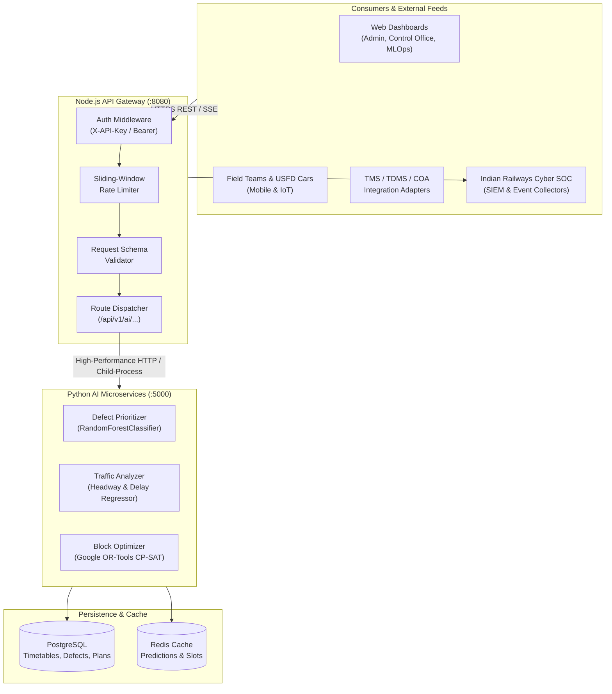

# Indian Railways AI Maintenance Platform — API Architecture Overview

## 1. Executive Summary

The **Indian Railways AI Maintenance Platform (IR-AIMP)** provides an enterprise REST and real-time streaming API gateway for automated track defect risk prioritization, corridor traffic disruption modeling, and multi-department maintenance block schedule optimization. 

The API layer bridges disparate railway operational data stores (TMS, TDMS, SMMS, USFD, COA, BDMS) with high-performance machine learning inference services, operating across all 17 Zonal Railways and 68 Operating Divisions.



---

## 2. Architectural Design Principles

1. **Dual-Mode Execution Resilience**:
   - Primary: High-speed REST calls over HTTP keep-alive to Python FastAPI daemon (`http://127.0.0.1:5000`).
   - Fallback: Transparent local execution via Node `child_process` invoking `python_runner.py` if the microservice daemon is unavailable.
2. **Strict Semantic Versioning**:
   - All stable routes reside under `/api/v1/ai/`. Breaking changes increment the major version prefix (`/api/v2/`).
3. **Correlation ID Tracing**:
   - Every request is tagged with an immutable UUID (`meta.correlation_id`), propagated across Node.js gateway logs, Python model inferences, and database queries for end-to-end auditability.
4. **Standardized Response Envelope**:
   - Every API endpoint returns a standardized top-level JSON structure with `success`, `data`, and `meta`.

```json
{
  "success": true,
  "data": {
    /* Route payload */
  },
  "meta": {
    "timestamp": "2026-09-06T03:30:00.000Z",
    "correlation_id": "4b52b344-325b-4c27-920f-07447d2f3428",
    "service": "priority-engine"
  }
}
```

---

## 3. Base URLs & Network Topology

| Environment | Base URL | Description |
|---|---|---|
| **Local Development** | `http://127.0.0.1:8080/api/v1/ai` | Direct local Node.js server |
| **Python Inference Daemon** | `http://127.0.0.1:5000/api/v1` | Direct Python FastAPI microservice |
| **Staging / UAT Cluster** | `https://staging-ai.cris.railnet.gov.in/api/v1/ai` | Zonal testing environment |
| **Production Primary (Delhi)** | `https://ai.maintenance.railnet.gov.in/api/v1/ai` | CRIS Chanakyapuri Data Center |
| **Production DR (Secunderabad)** | `https://ai-dr.maintenance.railnet.gov.in/api/v1/ai` | Hot Standby Disaster Recovery Site |

---

## 4. Key Subsystems

### 4.1 Defect Prioritization Engine
Employs an ensemble classifier (RandomForest + XGBoost) weighing 10 risk vectors (flaw depth %, track quality index, speed limit, traffic density GMT, days overdue, ultrasound reflection attenuation) to assign a numerical risk score (0–100) and regulatory action category (`P1`, `P2`, `P3`, `P4`).

### 4.2 Traffic Predictor & Slot Discovery
Processes dynamic section occupancy from live timetable feeds to identify unobstructed corridor maintenance windows, ranking slots by passenger/freight delay minimization and cascade disruption scores.

### 4.3 Multi-Department Block Constraint Optimizer
Utilizes Google OR-Tools CP-SAT (Constraint Programming) with 4 parallel search workers to solve NP-hard task-to-slot assignment problems while enforcing cross-department bundling rules (Civil, TRD/OHE, S&T) and resource constraints.

### 4.4 Model Governance & MLOps
Provides runtime inspection of model hyperparameters, real-time telemetry (concept drift PSI, P95 latency, error rates), and asynchronous retraining dispatch with quality gate enforcement.

---

## 5. Latency & Performance SLAs

| Operation | SLA P95 Target | Max Allowed Latency | Concurrency Target |
|---|---|---|---|
| Single Defect Prioritization | $< 40\text{ ms}$ | $100\text{ ms}$ | 200 req/sec |
| Batch Prioritization (500 items) | $< 180\text{ ms}$ | $500\text{ ms}$ | 20 req/sec |
| Corridor Slot Discovery | $< 60\text{ ms}$ | $150\text{ ms}$ | 100 req/sec |
| Best Slots Prediction | $< 80\text{ ms}$ | $200\text{ ms}$ | 50 req/sec |
| CP-SAT Schedule Optimization | $< 4.5\text{ s}$ | $30.0\text{ s}$ | 5 concurrent solves |
| Model Info & Telemetry Metrics | $< 15\text{ ms}$ | $50\text{ ms}$ | 500 req/sec |
