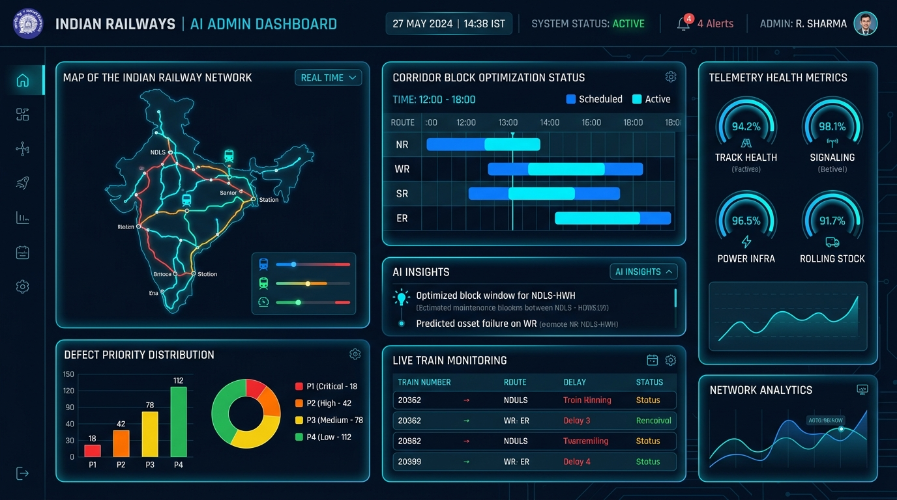

# Indian Railways AI Platform — Administrator User Guide

## 1. Role Overview & Target Audience

The **Administrator User Guide** is designed for Chief Track Engineers (CTE), Principal Chief Engineers (PCE), CRIS System Administrators, and MLOps Engineers responsible for overarching platform health, system-wide configuration, model lifecycle governance, and user role provisioning.

---

## 2. Admin Dashboard Visual Walkthrough

### Key Dashboard Components

1. **Network Rail Map & Status Overview**: Displays live section health across Northern Railway (NR), Western Railway (WR), Southern Railway (SR), and Eastern Railway (ER) with real-time train movement indicators.
2. **Corridor Block Optimization Timeline**: Visualizes scheduled vs. active maintenance blocks across major trunk corridors (NDLS-CNB, NDLS-MTC, NDLS-AGC).
3. **Defect Priority Distribution (P1–P4)**: Real-time categorical breakdown (P1 Critical: 18, P2 High: 42, P3 Medium: 78, P4 Low: 112).
4. **Telemetry Health Gauges**: Monitors Track Health Index (94.2%), Signaling Availability (98.1%), Power Traction Infrastructure (96.5%), and Rolling Stock compatibility (91.7%).
5. **AI Insights & Anomaly Feed**: Surfaces proactive warnings (e.g., predicted asset failure on Western Railway, optimal shadow block window on NDLS-HWH).

---

## 3. Step-by-Step Administrative Workflows

### Workflow 1: Inspecting Network Health & System Alerts
1. Navigate to the **Admin Dashboard** (`/frontend/pages/admin-dashboard.html`).
2. Verify the **System Status Badge** in the top navigation bar (must read `HEALTHY / GREEN`).
3. If an alert count is displayed (e.g., `4 Alerts`), click the alert bell to view the incident tray.
4. Review active incidents classified by severity (`CRITICAL`, `WARNING`, `INFO`).

### Workflow 2: Triggering AI Defect Re-scoring
When updated ultrasonic flaw detector (USFD) car logs or track geometry runs are ingested:
1. Scroll to the **Defect Prioritization Console**.
2. Click the **"⚡ Re-prioritize All Active Flaws"** button.
3. The platform dispatches batch inference to the Python AI microservice (`RandomForestClassifier` v1.2.0).
4. Inspect updated priority badges (P1 through P4) and SLA deadline updates across all sections.

### Workflow 3: MLOps Model Retraining & Quality Gates
1. Navigate to the **AI Model Lifecycle Console** (`/frontend/pages/ai-model-management.html`).
2. Verify trailing 30-day cross-validation accuracy and concept drift (PSI must be $< 0.10$).
3. Click **"Trigger Retraining Pipeline"**.
4. Monitor the 5-stage automated progress:
   - *Stage 1*: Ingest defects and timetables from PostgreSQL.
   - *Stage 2*: Feature extraction and standard scaling.
   - *Stage 3*: 5-fold stratified cross-validation.
   - *Stage 4*: Validate quality gates ($F_1 \ge 0.88$, P1 recall $\ge 98\%$).
   - *Stage 5*: Atomic hot-reload into RAM.

### Workflow 4: Authorizing Manual Safety Overrides
1. When an operational override is required, open the target work order or block window.
2. Click **"Manual Override"**.
3. In the [ManualOverrideModal](file:///c:/Users/ry729/.gemini/antigravity-ide/scratch/indian-railways-ai/frontend/components/ManualOverrideModal.js), input your **Officer ID** (e.g. `PCE-NR-04`), select a **Reason Code** (`TRACK_EMERGENCY`, `WEATHER_RESTRICTION`, `VVIP_MOVEMENT`), and input an audit explanation.
4. Confirm override. The transaction is committed to the immutable audit ledger.

---

## 4. Troubleshooting & Operational FAQs

- **Q: What should I do if the AI daemon status changes to `DEGRADED`?**
  - *A*: The system automatically switches to the child-process Python runner fallback. Check port 5000 service logs using `./deployment/scripts/internal_perf_runner.js` or `curl http://127.0.0.1:5000/api/v1/health`.
- **Q: How do I export audit logs for Safety Directorate compliance?**
  - *A*: Use the Log Aggregator query interface or query `database/backups/alerts_ledger.json`.
