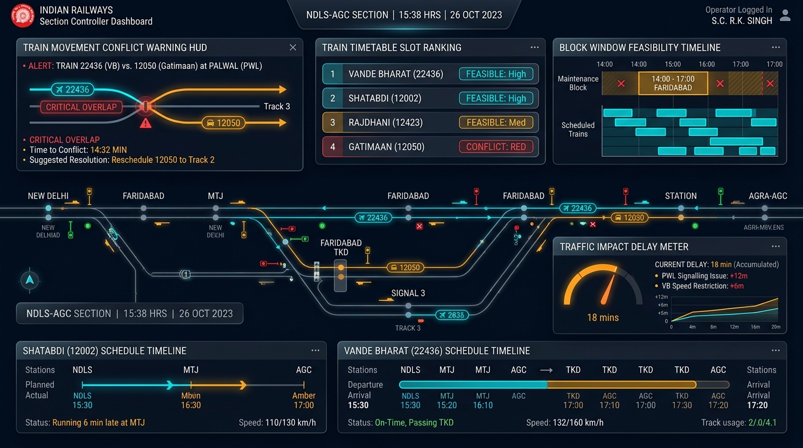

# Indian Railways AI Platform — Control Office User Guide

## 1. Role Overview & Target Audience

The **Control Office User Guide** is tailored for Section Controllers (SC), Chief Controllers (CHC), and Traffic Regulators operating in Divisional Control Offices (e.g., Delhi, Kanpur, Agra, Mumbai CSMT). Controllers are responsible for managing live train paths, approving or rescheduling maintenance corridor blocks, resolving train schedule conflicts, and minimizing passenger delays.

---

## 2. Control Office Dashboard Interface Walkthrough

### Key Interface Panels

1. **Train Movement Conflict Warning HUD**: Prominently highlights active collisions between scheduled train paths and proposed engineering blocks (e.g., `ALERT: Train 22436 Vande Bharat vs. 12050 Gatimaan at Palwal`).
2. **Train Timetable Slot Ranking**: Displays feasibility scores ranked by passenger punctuality impact:
   - `FEASIBLE: High` (Green): Unobstructed window; zero passenger delay.
   - `FEASIBLE: Med` (Amber): Minor goods regulation ($< 15\text{ mins}$).
   - `CONFLICT: Red` (Red): Infeasible window; direct conflict with Mail/Express services.
3. **Block Window Feasibility Timeline**: Interactive chronological track occupancy visualization showing current train headways, scheduled blocks, and track clearances.
4. **Traffic Impact Delay Meter**: Real-time gauge tracking cumulative corridor delay minutes, speed restriction penalties, and choke scores.
5. **Express Train Schedule Timelines**: Tracks on-time status and speed profiles for premium services (Shatabdi 12002, Vande Bharat 22436, Rajdhani 12423).

---

## 3. Step-by-Step Operational Workflows

### Workflow 1: Evaluating a Proposed Block Request
1. Open the **Control Office Dashboard** (`/frontend/pages/control-office.html`).
2. Select your active division and operating section (e.g., `NDLS-AGC Section`).
3. Locate the pending block request under **Pending Block Authorization Queue**.
4. Observe the AI Feasibility Indicator:
   - If **`HIGH_FEASIBILITY`**, the window does not infringe on high-priority train paths.
   - If **`INFEASIBLE`**, the conflict HUD will highlight the specific conflicted trains and projected delay minutes.

### Workflow 2: Approving & Sanctioning an Optimal Slot
1. Click on the recommended green slot (e.g., `01:30 – 04:30 Night Shadow`).
2. Verify that involved departments (Civil P-Way, TRD Electrical, S&T) are acknowledged.
3. Click **"Sanction Maintenance Block"**.
4. The system locks the corridor slot, publishes a temporary Caution Order notice, and updates the COA (Control Office Application) live feed.

### Workflow 3: Resolving a High-Priority Train Conflict
1. When a red alert appears in the Conflict HUD (e.g., conflict between proposed block and *12002 Shatabdi Express*):
2. Click **"View AI Suggested Alternatives"**.
3. The platform displays alternative slot options ranked by minimum passenger delay.
4. Select the optimal alternative window (e.g., shifting block forward by 45 minutes to utilize a diurnal freight gap).
5. Click **"Apply Alternative Schedule"**.

### Workflow 4: Emergency Forced Sanction with Audit Override
In situations where an emergency P1 rail fracture demands immediate line closure despite train delays:
1. Click **"Force Sanction (Emergency Override)"**.
2. Complete the mandatory **Manual Override Modal**:
   - Controller ID: `CHC-DELHI-02`
   - Authority Code: `SECTION-12-EMERGENCY-SAFETY`
   - Explanation: `Immediate 90-minute closure for fractured fishplate replacement at KM 145.2.`
3. Click **"Confirm Emergency Sanction"**. An emergency SMS dispatch is automatically routed to all affected drivers and Zonal HQ.

---

## 4. Best Practices for Section Controllers

- **Leverage Shadow Blocks**: Always prioritize multi-department bundled slots to avoid taking separate sequential closures.
- **Review Delay Meters**: Aim to keep section choke score $< 25.0$ during peak morning and evening passenger hours.
- **Immediate Conflict Triage**: Address all Red HUD alerts at least 60 minutes prior to train arrival at the section boundary station.
