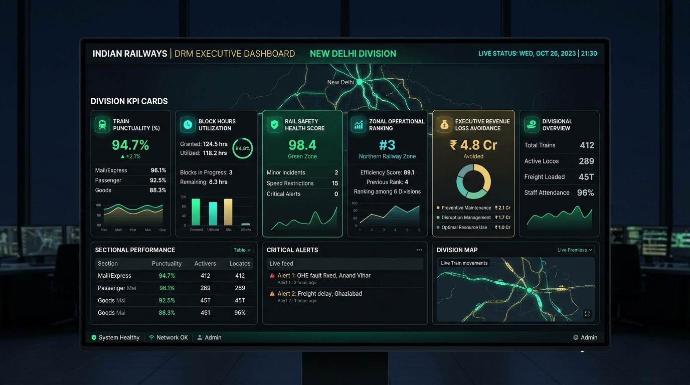

# Indian Railways AI Platform — DRM Executive Dashboard Guide

## 1. Role Overview & Target Audience

The **DRM Executive Dashboard Guide** is designed for Divisional Railway Managers (DRM), Additional Divisional Railway Managers (ADRM), Senior Divisional Operations Managers (Sr.DOM), and Senior Divisional Mechanical/Electrical Engineers (Sr.DME / Sr.DEE).

This executive portal delivers high-level operational intelligence, punctuality metrics, maintenance efficiency analysis, safety compliance indices, and financial revenue impact across the entire division.

---

## 2. DRM Dashboard Visual Interface Walkthrough

### Executive Key Performance Indicator (KPI) Panels

1. **Train Punctuality (%)**: Current divisional punctuality rate ($94.7\%$, $+2.1\%$ trend). Broken down by:
   - *Mail / Express Services*: $96.1\%$
   - *Suburban Passenger Services*: $92.5\%$
   - *Freight & Goods Traffic*: $88.3\%$
2. **Block Hours Utilization Rate**: Tracks maintenance hours granted vs. actually utilized ($124.5\text{ hrs granted}$ vs. $118.2\text{ hrs utilized} = 94.8\%$ utilization efficiency).
3. **Rail Safety Health Score**: Comprehensive composite safety health index ($98.4$ — Green Zone), tracking minor incidents, active speed restrictions, and zero critical breaches.
4. **Zonal Operational Ranking**: Live comparative performance ranking among all divisions in the Zone (e.g., `#3 in Northern Railway Zone`).
5. **Executive Revenue Loss Avoidance**: Monetized value of delays averted through AI preventive maintenance bundling ($\mathbf{₹4.8\text{ Crores}}$ saved this month).
6. **Divisional Overview & Sectional Table**: Active locomotives ($289$), freight tonnage loaded ($45\text{ MT}$), and staff attendance rate ($96\%$).

---

## 3. Executive Decision Workflows

### Workflow 1: Daily Morning Divisional Review
1. Launch the **DRM Executive Dashboard** during the daily morning operational review.
2. Review the **Train Punctuality Gauge**:
   - If punctuality is $\ge 94\%$, operational health is in Green optimal status.
   - If punctuality dips $< 90\%$, click on the gauge to inspect which specific operating section caused cascade delays.
3. Review **Speed Restrictions (TSR)**:
   - Inspect active caution orders; evaluate whether scheduled engineering blocks are resolving speed restrictions on time.

### Workflow 2: Monitoring Block Hour Grant vs. Utilization
A historic friction point on Indian Railways has been operating departments granting blocks that engineering departments under-utilize:
1. Examine the **Block Hours Utilization** donut chart.
2. If utilization falls $< 80\%$, review unutilized block hours by department (Civil vs. Electrical).
3. Directly request an explanation from the Senior Divisional Engineer regarding machine breakdown or labor shortages.

### Workflow 3: Evaluating Financial Revenue Avoidance & Capex
1. Review the **Executive Revenue Loss Avoidance** breakdown:
   - *Preventive Maintenance Value*: ₹2.1 Cr
   - *Disruption Penalty Mitigation*: ₹1.7 Cr
   - *Multi-Department Resource Optimization*: ₹1.0 Cr
2. Export the monthly executive summary for presentation to the General Manager (GM) and Railway Board.

### Workflow 4: Escalation & Emergency Inquiry Oversight
1. When a Critical Safety Alert appears in the **Critical Alerts Live Feed**:
2. Click the alert to view root-cause analysis (e.g., *OHE Pantograph fault fixed near Anand Vihar*).
3. Check who sanctioned the block, the total line occupation time, and confirmation of track clearance.
4. If required, click **"Initiate Divisional Safety Inquiry"** to mandate formal review within 48 hours.

---

## 4. Executive Summary Checklist for DRMs

- [ ] **Punctuality Target**: Ensure division maintains $> 95\%$ for passenger services.
- [ ] **Zero P1 Overdue Violations**: Confirm zero P1 defects remain unscheduled beyond 24 hours.
- [ ] **Maximizing Multi-Department Synergy**: Encourage Civil and Electrical departments to maintain $> 80\%$ bundled block planning.
