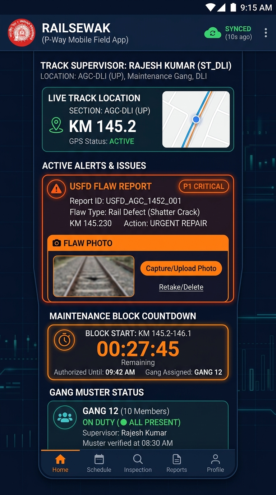

# Indian Railways AI Platform — Mobile Field Application (Railsewak) User Guide

## 1. App Overview & Target Audience

The **Railsewak Mobile Field Application** is built for Permanent Way Track Supervisors (P-Way), Gang Mates, Keymen, Patrolmen, USFD Technicians, and Overhead Equipment Line Crews working trackside in all weather conditions.

The app supports ruggedized Android tablets and field smartphones, featuring full offline caching, GPS location tagging, camera flaw inspection, and real-time block timer countdowns.

---

## 2. Mobile App Interface Walkthrough

### Key Mobile Interface Modules

1. **Header & Offline Sync Indicator**: Shows active supervisor profile (`Supervisor: Rajesh Kumar ST_DLI`), network connectivity, and cloud synchronization status (`SYNCED 10s ago` or `OFFLINE MODE (3 reports queued)`).
2. **Live Track Location Module**: GPS-verified railway chainage displaying active route (`Section: AGC-DLI UP`), current kilometer post (`KM 145.2`), and live satellite GIS track map.
3. **Active Alerts & Issue Card**: Displays prioritized defect warnings (e.g. `USFD FLAW REPORT - P1 CRITICAL: Shatter Crack at KM 145.230`).
4. **Flaw Photo Capture / Upload**: High-resolution camera integration allowing field supervisors to snap photo evidence of cracked welds, broken sleepers, or misaligned points.
5. **Maintenance Block Countdown Timer**: Large digital countdown clock displaying remaining authorized line closure time (`00:27:45 Remaining`), authorized boundary limits, and assigned gang code (`Gang 12`).
6. **Gang Muster Status**: Personnel roll-call tracker confirming gang presence (`Gang 12: 10 Members On Duty, All Present, Muster Verified at 08:30 AM`).

---

## 3. Step-by-Step Field Workflows

### Workflow 1: Morning Check-in & Gang Muster Verification
1. Launch the **Railsewak App** on your field device.
2. Log in using your Indian Railways Employee Number (PF Number) and biometric/PIN.
3. Tap **"Gang Muster Status"**.
4. Check off each gang member present:
   - Verify safety helmets, reflective jackets, safety shoes, and red/green hand signal flags.
5. Tap **"Verify Muster"**. The muster timestamp is immediately recorded in the divisional labor ledger.

### Workflow 2: Reporting a New Track Defect with Camera & USFD
When encountering a rail flaw during routine foot patrol or USFD inspection:
1. Tap **"New Defect Report"**.
2. The app automatically populates the exact **GPS chainage** (e.g. `KM 145.230`).
3. Select the flaw type from the dropdown:
   - `Rail Defect (Transverse Fissure / Shatter Crack)`
   - `Weld Fracture`
   - `Missing Elastic Rail Clip (ERC)`
   - `Sun Kink / Buckled Track`
4. Tap **"Capture/Upload Photo"**. Align camera crosshairs with the flaw and snap photo.
5. Tap **"Submit Defect Report"**.
6. The AI engine scores the flaw in real time and returns the priority rating (e.g. **`P1 CRITICAL`**).

### Workflow 3: Managing Active Block with Countdown Timer
1. When the Section Controller grants the maintenance block:
2. The app sounds an audible confirmation tone and the **Maintenance Block Countdown Timer** begins counting down (e.g., `01:30:00`).
3. The supervisor places red banner flags and detonators on both sides of the work site according to General Rules (GR).
4. As the timer approaches 15 minutes remaining, the timer turns amber and pulses.
5. At 5 minutes remaining, an audible warning alert sounds, prompting the supervisor to begin clearing the track of all tools, ballast rakes, and gang members.

### Workflow 4: Clearing the Track & Lifting the Block
1. Ensure all personnel and tools have moved outside the safety clearance zone ($2.5\text{ m}$ from track centerline).
2. Remove red banner flags and detonator protection.
3. In the app, tap **"Track Cleared & Safe"**.
4. Select track clearance status:
   - *Full Line Speed (Normal)*
   - *Temporary Speed Restriction (TSR)* — enter speed in km/h (e.g., `30 km/h`).
5. Tap **"Authorize Line Re-opening"**. Confirmation is routed directly to the Section Controller's console.

### Workflow 5: Offline Operation in Remote Corridors
1. In remote cutting, ghat, or jungle sections where 4G/5G mobile signal is unavailable:
2. The app automatically switches to **Offline Mode** (cloud icon turns amber).
3. All defect reports, photos, and muster logs are saved in local SQLite storage.
4. As soon as the device re-enters cellular coverage or connects to station Wi-Fi, the app automatically uploads all queued records without data loss.

---

## 4. Field Safety Rules (IRPWM Chapter 8)

- **Banner Flag Protection**: Red banner flags must be erected at $600\text{ m}$ and three detonators placed $10\text{ m}$ apart at $1200\text{ m}$ from the work site before commencing any work on track.
- **Strict Countdown Compliance**: Never exceed the authorized countdown timer under any circumstances without prior verbal and digital extension from the Section Controller.
- **High Visibility**: Reflective high-visibility safety clothing must be worn at all times while within the railway boundary.
