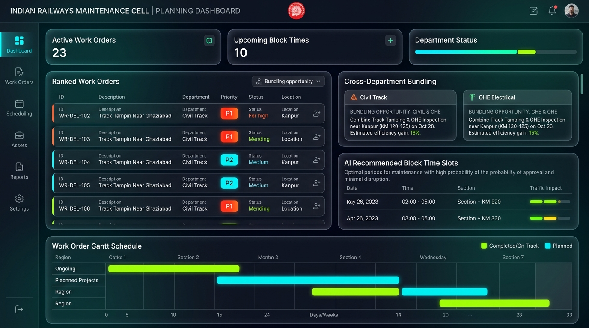

# Indian Railways AI Platform — Maintenance Cell User Guide

## 1. Role Overview & Target Audience

The **Maintenance Cell User Guide** is designed for Divisional Engineers (DEN / Sr.DEN), Assistant Engineers (AEN), Permanent Way Supervisors (P-Way), Overhead Equipment (OHE/TRD) Engineers, and Signal & Telecommunication (S&T) Coordinators. 

These teams submit block requests, assign maintenance gangs, review AI priority rankings, and coordinate multi-department bundling.

---

## 2. Maintenance Dashboard Interface Walkthrough

### Key Interface Panels

1. **Ranked Work Orders Grid**: Prioritizes open maintenance requests in descending order of risk using the AI defect prioritizer (`P1 Critical`, `P2 High`, `P3 Medium`, `P4 Low`).
2. **Cross-Department Bundling Opportunities**: Identifies where Civil Track and OHE Electrical gangs can work simultaneously within a single shared corridor block (e.g., combining Track Tamping and OHE Cantilever replacement near Kanpur for 15% efficiency gain).
3. **AI Recommended Block Time Slots**: Surfaces pre-calculated feasible maintenance windows characterized by low passenger disruption and high approval likelihood.
4. **Work Order Gantt Schedule**: Timeline tracking planned vs. ongoing projects across regional zones and calendar weeks.
5. **Department Resource Status**: Shows gang muster availability and heavy track equipment status (BCM, CSM, Tamping machines, Tower wagons).

---

## 3. Step-by-Step Maintenance Workflows

### Workflow 1: Reviewing AI-Prioritized Work Orders
1. Open the **Maintenance Dashboard** (`/frontend/pages/maintenance-dashboard.html`).
2. Filter work orders by your department (e.g., `Civil Track`).
3. Notice the **Priority Badges**:
   - **`P1 Critical`**: 24-hour mandatory SLA. Requires immediate block request.
   - **`P2 High`**: 72-hour SLA. Must be scheduled in the upcoming weekly block plan.
   - **`P3 Medium`** / **`P4 Low`**: Can be bundled into routine seasonal corridor closures.
4. Click on any work order to expand the **AI Explanation Card** to inspect flaw depth %, GMT traffic weight, and safety rationale.

### Workflow 2: Accepting Cross-Department Bundling Suggestions
1. Inspect the **Cross-Department Bundling** panel.
2. Review the bundled proposal (e.g., `Civil Track Tamping & OHE Inspection near Kanpur KM 120-125`).
3. Verify that both Civil gangs and OHE Tower Wagons are equipped and available.
4. Click **"Accept Bundled Proposal"**.
5. The platform automatically combines the two separate requests into a single unified shadow block request with shared safety boundaries and reduced line closure time.

### Workflow 3: Submitting a Maintenance Block Request
1. Click the **"+ Request Maintenance Block"** button.
2. Fill in block parameters:
   - Section: `NDLS-CNB-UP` (Between KM 120.0 and 125.0)
   - Desired Date: `2026-09-08`
   - Duration Requested: `180 minutes`
   - Gang Number: `Gang 12 (10 Members)`
   - Heavy Machine: `CSM Tamping Machine 09-3X`
3. Click **"Check AI Feasibility"**. The platform queries the Traffic Predictor to check for express train conflicts.
4. Click **"Submit to Control Office"**.

### Workflow 4: Completing a Work Order & Clearing Block
1. Upon finishing track maintenance on site:
2. Confirm track is cleared of all personnel, tools, and ballast regulators.
3. Confirm with traction controller that OHE power has been re-energized.
4. Click **"Close Work Order"** on the dashboard.
5. Enter clearance speed restriction (e.g., `Normal 110 km/h` or `Caution Order 30 km/h for 24 hours`).
6. Click **"Sign-off Block"**. Notification is instantly sent to the Section Controller.

---

## 4. Maintenance Guidelines & Best Practices

- **Never Split Bundles Unnecessarily**: Multi-department bundling delivers an average of 28.5% time savings across engineering disciplines.
- **Strict Adherence to P1 SLAs**: P1 critical flaws unaddressed after 24 hours trigger automated escalation to the DRM and Chief Track Engineer.
- **Always Verify Caution Orders**: Ensure any speed restriction (TSR) is logged into the system before releasing the track.
