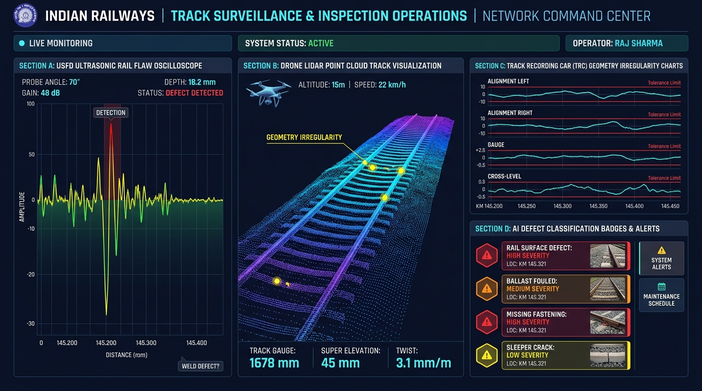

# Indian Railways AI Platform — Surveillance Team User Guide

## 1. Role Overview & Target Audience

The **Surveillance Team User Guide** is designed for Track Inspection Engineers, Ultrasonic Flaw Detection (USFD) Operators, Drone LiDAR Survey Pilots, Track Recording Car (TRC) Specialists, and Oscillation Monitoring System (OMS) Officers. 

These specialists operate physical and airborne inspection instrumentation, interpret raw sensor telemetry, validate detected track flaws, and immediately triage safety hazards.

---

## 2. Surveillance Dashboard Interface Walkthrough

### Key Telemetry Panels

1. **Section A: USFD Ultrasonic Rail Flaw Oscilloscope**: Live A-scan & B-scan acoustic waveform visualizer displaying probe angle ($70^\circ$), gain ($48\text{ dB}$), reflection depth ($18.2\text{ mm}$), and automated defect detection envelope.
2. **Section B: Drone LiDAR Point Cloud Track Visualization**: 3D geometric mesh rendering of track ballast, sleepers, rail cant, gauge ($1678\text{ mm}$), super-elevation ($45\text{ mm}$), and twist ($3.1\text{ mm/m}$) captured at $15\text{ m}$ altitude.
3. **Section C: Track Recording Car (TRC) Geometry Irregularity Charts**: Continuous real-time strip charts plotting Left Alignment, Right Alignment, Track Gauge, and Cross-Level deviation against safety tolerance limits.
4. **Section D: AI Defect Classification Badges & Alerts**: Neural-vision triage feed categorizing detected flaws with severity badges:
   - *Rail Surface Defect*: High Severity (Location: KM 145.321)
   - *Ballast Fouled*: Medium Severity
   - *Missing Fastening (ERC Clip)*: High Severity
   - *Sleeper Crack*: Low Severity

---

## 3. Step-by-Step Inspection Workflows

### Workflow 1: Diagnosing Ultrasonic USFD Waveform Anomalies
1. Open the **Surveillance Console** (`/frontend/pages/surveillance-dashboard.html`).
2. Connect to the active USFD trolley or digital rail tester feed.
3. Observe Section A (USFD Oscilloscope):
   - A normal rail returns standard bottom-of-rail backwall echo ($100\%$ amplitude).
   - If a sharp intermediate peak appears (e.g. at depth $18.2\text{ mm}$ with $> 60\%$ screen height), the AI flags `DEFECT DETECTED (Weld / Transverse Fissure)`.
4. Click on the waveform to inspect acoustic attenuation and probe angle metadata ($0^\circ$ normal probe, $70^\circ$ rail head flaw probe, or $45^\circ$ bolt hole flaw probe).

### Workflow 2: Triaging Drone LiDAR 3D Geometry Flaws
1. Select **Section B (Drone LiDAR)** in the console.
2. Review the 3D point cloud mesh along the surveyed corridor.
3. High-risk track geometry breaches are highlighted with glowing yellow markers.
4. Check real-time track measurements:
   - **Broad Gauge**: Must remain within $1676\text{ mm} \pm 6\text{ mm}$.
   - **Super Elevation**: Check design cant vs. actual cant on curves.
   - **Twist**: Ensure twist does not exceed $3.5\text{ mm/m}$ on high-speed sections.
5. Click **"Confirm Geometry Flaw"** to sync coordinates to the GIS database.

### Workflow 3: Automated Flaw Ingestion & Work Order Generation
1. In **Section D (AI Defect Classification)**, click on any flagged defect card (e.g. *Rail Surface Defect at KM 145.321*).
2. Review high-resolution visual optical imagery alongside ultrasonic telemetry.
3. Click **"Generate AI Work Order"**.
4. The system automatically computes the priority score, assigns the defect to the responsible Senior Section Engineer (P-Way), and notifies the Divisional Maintenance Cell.

### Workflow 4: Calibrating USFD Testing Units
1. Every morning before beginning field testing:
2. Place the USFD testing trolley on the standard International Union of Railways (UIC) calibration test piece.
3. Adjust gain until the $2\text{ mm}$ diameter flat-bottom artificial flaw hole reflects at $60\%$ full screen height (FSH).
4. On the dashboard, click **"Log USFD Daily Calibration"** to store digital calibration records for compliance.

---

## 4. Safety directorate Standards (IRPWM Manual)

- **Immediate Action Threshold**: Any flaw exhibiting $> 3\text{ dB}$ signal loss or transverse fissure $> 15\text{ mm}$ depth must be protected immediately with a temporary 20 km/h caution order.
- **Drone Safety Clearance**: Maintain minimum $15\text{ m}$ vertical clearance above live $25\text{ kV}$ AC OHE traction wires at all times.
